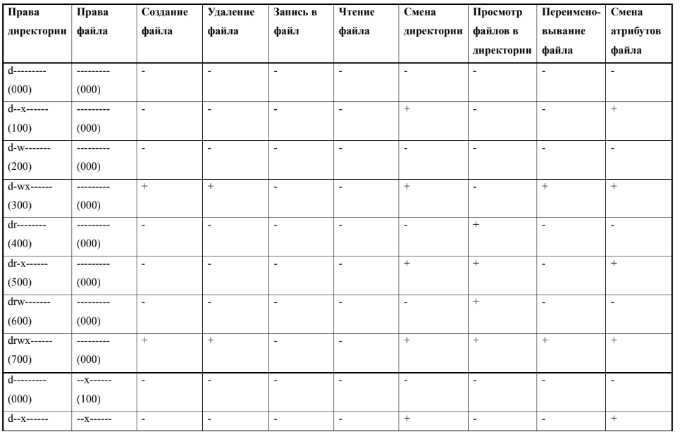
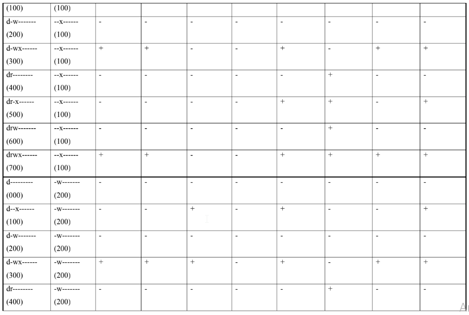
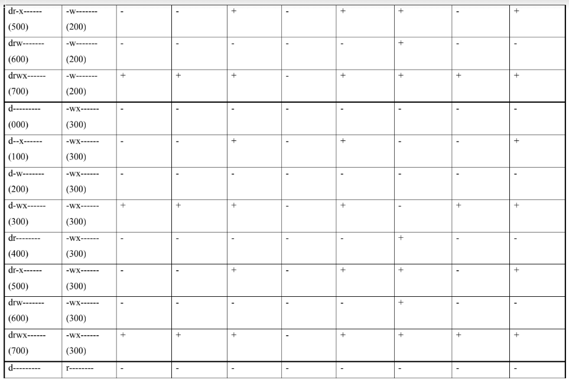
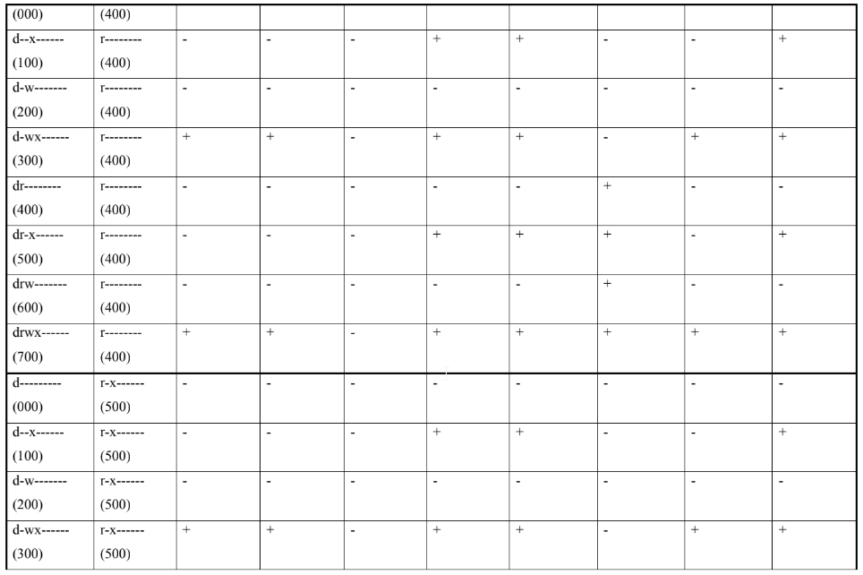
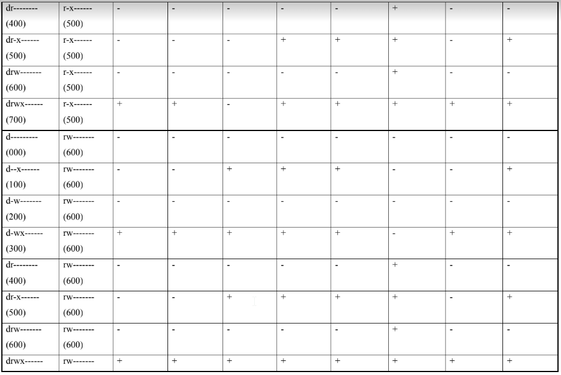
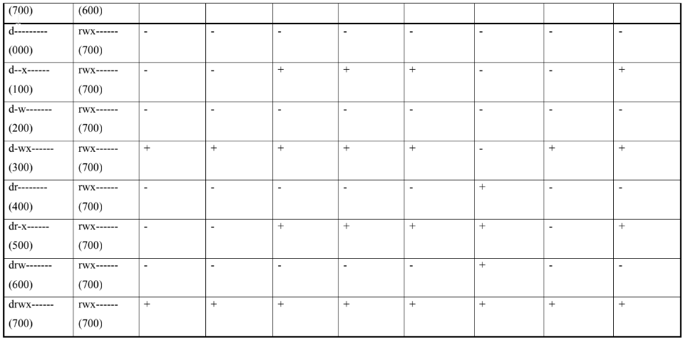
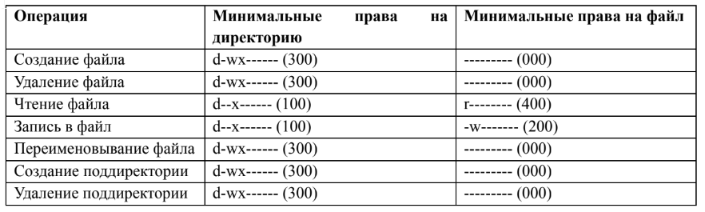

---
# Front matter
lang: ru-Ru
title: "Лабораторная работа №2"
subtitle: "Дискреционное разграничение прав в Linux. Основные атрибуты."
author: "Смирнов Артем"

# Formatting
toc-title: "Содержание"
toc: true # Table of contents
toc_depth: 2
lof: true # List of figures
lot: true # List of tables
fontsize: 12pt
linestretch: 1.5
papersize: a4paper
documentclass: scrreprt
polyglossia-lang: russian
polyglossia-otherlangs: english
mainfont: PT Serif
romanfont: PT Serif
sansfont: PT Sans
monofont: PT Mono
mainfontoptions: Ligatures=TeX
romanfontoptions: Ligatures=TeX
sansfontoptions: Ligatures=TeX,Scale=MatchLowercase
monofontoptions: Scale=MatchLowercase
indent: true
pdf-engine: xelatex
header-includes:
  - \linepenalty=10 # the penalty added to the badness of each line within a paragraph (no associated penalty node) Increasing the value makes tex try to have fewer lines in the paragraph.
  - \interlinepenalty=0 # value of the penalty (node) added after each line of a paragraph.
  - \hyphenpenalty=50 # the penalty for line breaking at an automatically inserted hyphen
  - \exhyphenpenalty=50 # the penalty for line breaking at an explicit hyphen
  - \binoppenalty=700 # the penalty for breaking a line at a binary operator
  - \relpenalty=500 # the penalty for breaking a line at a relation
  - \clubpenalty=150 # extra penalty for breaking after first line of a paragraph
  - \widowpenalty=150 # extra penalty for breaking before last line of a paragraph
  - \displaywidowpenalty=50 # extra penalty for breaking before last line before a display math
  - \brokenpenalty=100 # extra penalty for page breaking after a hyphenated line
  - \predisplaypenalty=10000 # penalty for breaking before a display
  - \postdisplaypenalty=0 # penalty for breaking after a display
  - \floatingpenalty = 20000 # penalty for splitting an insertion (can only be split footnote in standard LaTeX)
  - \raggedbottom # or \flushbottom
  - \usepackage{float} # keep figures where there are in the text
  - \floatplacement{figure}{H} # keep figures where there are in the text
---

# Цель работы

Получение практических навыков работы в консоли с атрибутами файлов, закрепление теоретических основ дискреционного разграничения доступа в современных системах с открытым кодом на базе ОС Linux.

# Выполнение лабораторной работы

1. Создам учётную запись пользователя guest (использую учётную запись администратора).
2. Задам пароль для пользователя guest.

!

3. Войду в систему от имени пользователя guest.

{#fig:001}

4. Определю директорию, в которой я нахожусь, командой pwd. 

   {#fig:003}

   Домашняя директория.

5. Уточню имя пользователя командой whoami.

   {#fig:004}

6. Уточню имя  пользователя, его группу, а также группы, куда входит пользователь, командой id. 

   {#fig:005}

​		uid = 1001, gid = 1001.

​		Команда id выводит много больше информации.

7. Полученная информация об имени пользователя совпадает с данными, выводимыми в приглашении командной строки.

8. Просмотрим файл /etc/passwd командой cat /etc/passwd Найдем в нём свою учётную запись. Определим uid пользователя. Определим gid пользователя. Сравним найденные значения с полученными в предыдущих пунктах.

   {#fig:006}
   
   

​		uid = 1001 и gid = 1001.

9. Определю существующие в системе директории. 

   {#fig:007}

​		  Мне удалось получить список поддиректорий директории /home. У пользователя, создавшего директорию (adyvarov и guest) есть права на чтение (r), запись (w) и  выполнение (x)  файлов в директории. У других пользователей никаких прав нет.

10. Проверю, какие расширенные атрибуты установлены на поддиректориях, находящихся в директории /home.

    {#fig:008}

​		  Мне не удалось увидеть расширенные атрибуты как текущей директории, так и  директории  другого пользователя.

11. Создам в домашней директории поддиректорию dir1 командой mkdir dir1. Определим командами ls -l и lsattr, какие права доступа и расширенные атрибуты были выставлены на директорию dir1.

    {#fig:009}

    У всех есть права на чтение и выполнение, но только у создателя и группы создателя есть права на запись. Расширенные атрибуты просмотреть не удалось.

12. Сниму с директории dir1 все атрибуты командой chmod 000 dir1 и проверю с её помощью правильность выполнения команды ls -l.

    {#fig:010}

13. Попытаюсь создать в директории dir1 файл file1 командой echo "test" > /home/guest/dir1/file1.

    {#fig:011}

    Мне было отказано в создании файла так как ни у кого из пользователей нет прав на создание файла. Проверю наличие файла file1 в директории dir1.

    {#fig:012}

​	 Поскольку права на просмотр директории закрыты, я не смог просмотреть файлы директории.

14. Заполню таблицу «Установленные права и разрешенные действия». 

    {#fig:013}

{#fig:014}

{#fig:015}

{#fig:016}

{#fig:017}

{#fig:018}

15. Заполню таблицу «Минимальные права для совершения операций».

{#fig:019}

### Вывод

В ходе данной лабораторной работы мы получили практические навыки работы в консоли с атрибутами файлов, закрепили теоретические основы разграничения доступа на базе ОС Linux.

# Список литературы

- <code>[Кулябов Д. С., Королькова А. В., Геворкян М. Н Лабораторная работа №2](https://esystem.rudn.ru/pluginfile.php/1651747/mod_resource/content/6/002-lab_discret_attr.pdf)</code>